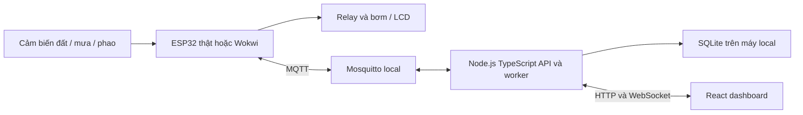
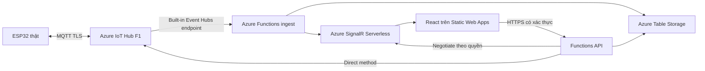

# Kế hoạch hệ thống tưới cây: Wokwi → local → thiết bị thật → Azure

Ngày lập: 28/09/2026. Căn cứ: [README đề bài](../readme.md), `platformio.ini`, `src/main.cpp`, `diagram.json` và tài liệu được dẫn tại từng phần.

**Cập nhật triển khai:** phần hiện trạng dưới đây là ảnh chụp lúc lập kế hoạch, trước khi viết firmware. Xem [tiến độ hiện hành](TIEN_DO.md) và [biên bản kiểm thử](KIEM_THU_FIRMWARE.md) để biết phần đã làm. Điện trở, cấp nguồn và netlist bản mới nằm trong [thiết kế phần cứng](PHAN_CUNG_THUC_TE.md); thông tin này thay các lựa chọn sơ bộ ở mục 3 khi lắp thật.

Đây là thiết kế và kế hoạch triển khai, chưa phải hệ thống đã hoàn thành hoặc kết quả kiểm thử thực tế. Phạm vi giả định: một ESP32, một chậu/vùng tưới, Wi-Fi 2,4 GHz, một bơm DC, 1–3 người xem dashboard; nhóm làm trong khoảng 4 tuần. Điều chỉnh thời gian và ngân sách khi biết lịch nộp, linh kiện đã có và loại cây.

## 1. Phương án đề xuất và hiện trạng

ESP32 chịu trách nhiệm đọc cảm biến và quyết định tưới tại chỗ. Website React dùng để xem dữ liệu, lịch sử, cảnh báo và gửi lệnh có thời hạn. Mất mạng không làm mất bộ điều khiển tự động; các giới hạn bảo vệ nằm trong firmware. Làm đủ bản local trước, sau đó thay lớp truyền thông bằng Azure IoT Hub.

| Hiện trạng đã đọc | Việc cần làm |
|---|---|
| PlatformIO dùng Arduino, `esp32doit-devkit-v1` | Giữ cấu hình mô phỏng; thêm cấu hình board thật đúng SKU |
| `src/main.cpp` chỉ nháy LED | Sửa `Serial.begin(1152col0)` thành `Serial.begin(115200)` ở bước triển khai đầu tiên |
| `diagram.json` chỉ có ESP32, chưa nối dây | Thêm đầu vào giả lập độ ẩm, mưa, LCD và đầu ra bơm |
| Chưa có `wokwi.toml` | Trỏ tới firmware và ELF sinh từ PlatformIO |
| Chưa có backend, frontend, nơi lưu lịch sử | Tạo các thành phần ở mục 4–7 |
| Thư mục chưa được Git nhận diện là repository | Khởi tạo Git, quy định nhánh và bỏ qua bí mật khi bắt đầu triển khai |

### Đối chiếu yêu cầu đề bài

| Yêu cầu | Cách đáp ứng | Bằng chứng phải nộp |
|---|---|---|
| ESP32, ít nhất 2 cảm biến | Độ ẩm đất điện dung và cảm biến mưa; thêm phao cạn nước | Sơ đồ dây, ảnh thiết bị, dữ liệu raw |
| Ít nhất 2 thiết bị vào/ra | Các cảm biến, relay/bơm, LCD, nút dừng | Video và sơ đồ |
| Wokwi trên VS Code | Biến trở giả lập cảm biến đất; công tắc giả lập mưa; LCD và LED/relay | `diagram.json`, `wokwi.toml`, video |
| Tự động và thủ công | State machine tại ESP32; lệnh tưới giới hạn thời gian | Test AUTO, MANUAL, STOP |
| Wi-Fi/MQTT, điều khiển từ xa | Mosquitto local; MQTT/TLS với Azure IoT Hub | Log telemetry, lệnh và ACK |
| Dashboard có biểu đồ và lịch sử | React + API + realtime + kho dữ liệu | URL, ảnh, dữ liệu sau reload |
| Mưa và thay đổi độ ẩm có thông báo | Sự kiện mưa và xu hướng độ ẩm đo độc lập | Test phun nước lên tấm mưa/đất |
| Ít nhất 3 kịch bản | Bộ 15 ca kiểm thử ở mục 10 | Biên bản có kết quả thực đo |
| Hồ sơ hoàn chỉnh | Kiến trúc, dây, code, báo cáo, kết quả, video | Danh mục mục 12 |

Biến trở/công tắc là đầu vào mô phỏng hai đại lượng, không phải mô hình vật lý đất và mưa. Cần mô tả rõ trong báo cáo và xác nhận cách trình bày với giảng viên. Không suy ra trời mưa chỉ vì đất ẩm tăng: tưới tay cũng làm đất ẩm tăng; tấm mưa chỉ phát hiện bị ướt, không đo lượng mưa mm.

## 2. Kiến trúc và lựa chọn công nghệ

### Local



### Azure



Lựa chọn local: React + TypeScript + Vite; Node.js + TypeScript + Express; SQLite; MQTT client; WebSocket; thư viện biểu đồ. Azure dùng Functions TypeScript, Table Storage, SignalR và Static Web Apps. Chốt phiên bản Node đang được Functions hỗ trợ tại lúc triển khai, sau đó khóa dependency; không tự động dùng Node mới nhất ở mọi nơi.

Không triển khai đồng thời Blynk, Node-RED và website riêng. HiveMQ WebSocket demo chỉ dùng chẩn đoán thử nghiệm, không làm backend cho bơm thật. Không cần Kubernetes, Digital Twins, AI hay PostgreSQL trả phí cho một chậu cây.

**Khác biệt phải lập trình:** IoT Hub không phải broker MQTT tổng quát, không thể chuyển Azure chỉ bằng đổi hostname. Tạo `TransportLocalMqtt` và `TransportAzureIoTHub` dùng chung sensor/control logic, nhưng ánh xạ topic, xác thực và lệnh riêng. IoT Hub yêu cầu TLS và topic quy định sẵn. [Nguồn Microsoft](https://learn.microsoft.com/en-us/azure/iot-hub/iot-mqtt-connect-to-iot-hub).

## 3. Phần cứng, điện và nối dây dự kiến

Chọn ESP32 cổ điển NodeMCU-32S/DevKit có GPIO34, 21, 22, 26, 27, 32, 33 để gần cấu hình hiện tại. Không thay bằng ESP32-C3/S3 mà giữ nguyên pin map. SKU đã tìm được và dự toán nằm trong [báo cáo mua sắm](BAO_CAO_MUA_SAM.md).

| Chức năng | GPIO dự kiến | Mô phỏng | Thiết bị thật và điều kiện |
|---|---:|---|---|
| Độ ẩm đất analog | 34, ADC1 | Biến trở: SIG→34, hai đầu 3V3/GND | Cảm biến điện dung AO→34, VCC→3V3, GND chung |
| Phát hiện mưa | 27 | Công tắc→GND, pull-up 3V3 | Bản mưa kèm relay 12V: chỉ đưa tiếp điểm khô về GPIO/GND |
| Điều khiển bơm | 26 | LED qua 330Ω hoặc relay mô phỏng | Qua tầng transistor điều khiển IN relay 5V |
| LCD SDA/SCL | 21/22 | LCD1602 chế độ I2C | LCD I2C 5V qua chuyển mức hai chiều 3V3↔5V |
| Phao cạn | 33 | Công tắc | Tiếp điểm đóng khi đủ nước, mở khi cạn/đứt dây; pull-up 10kΩ về 3V3 |
| Nút STOP | 32 | Nút nhấn về GND | `INPUT_PULLUP`, chống dội; công tắc cắt điện bơm riêng |

GPIO34 chỉ làm đầu vào; dùng ADC1 cho đo đất khi Wi-Fi hoạt động. Không đưa 5V/12V vào GPIO. Chọn attenuation phù hợp, đo điện áp đầu ra và kiểm tra clipping khi hiệu chuẩn. [ESP32 datasheet](https://documentation.espressif.com/esp32_datasheet_en.html), [ESP32 GPIO](https://github.com/espressif/esp-idf/blob/master/docs/en/api-reference/peripherals/gpio/esp32.inc).

### Cấp nguồn và mạch công suất

```text
Adapter kín 12V/3A → cầu chì + công tắc nguồn → nhánh 12V
  ├─ cảm biến mưa relay 12V
  ├─ công tắc cắt bơm → COM relay bơm → NO → Bơm (+)
  │                                            Bơm (-) → GND nguồn
  └─ buck LM2596 chỉnh 5,0V → ESP32 chân 5V phù hợp board, LCD, relay 5V

GPIO26 → điện trở base khoảng 2,2kΩ → B transistor NPN
NPN E → GND; C → IN relay 5V; base kéo xuống GND bằng 10kΩ
Relay VCC → 5V; relay GND → GND
Diode dập xung song song bơm: cathode → bơm (+), anode → bơm (-)
```

Với tầng đảo NPN này, GPIO26 HIGH làm IN relay LOW và bật bơm; GPIO LOW/tắt MCU phải làm bơm OFF. Xác minh dòng IN và chân transistor trên hàng thật; đây là thiết kế dự kiến cần đo trước khi ráp. IN relay phải có bias OFF phía 5V phù hợp module; không kéo trực tiếp GPIO lên 5V. Dùng tiếp điểm NO để mất nguồn relay thì bơm dừng. Không nhầm diode bảo vệ cuộn relay trên module với diode bảo vệ motor bơm.

Chọn diode, cầu chì, dây và tiếp điểm theo dòng khởi động/kẹt đo được, không dựa riêng vào chữ “10A AC” trên relay. Dự kiến diode cỡ 3A cho bơm nhỏ; đổi nếu dòng xung vượt thông số. Dây công suất dùng terminal và dây đủ tiết diện, không chạy dòng bơm qua breadboard/Dupont. Tách đường hồi dòng motor khỏi nhánh logic; thêm tụ lọc gần buck/ESP32, kiểm tra reset do sụt áp khi đóng bơm.

LCD có thể kéo SDA/SCL lên 5V: dùng chuyển mức I2C, phía LV→3V3, HV→5V và GND chung. Địa chỉ quét thực tế rồi cấu hình, không mặc định luôn là 0x27.

Cảm biến mưa trong BOM có nguồn 12V và relay: đo thông mạch/điện áp để xác nhận COM/NO/NC thật sự là tiếp điểm khô trước khi đưa về GPIO27. COM nối GND logic, chân tiếp điểm phù hợp nối GPIO27 với pull-up 10kΩ về 3V3; thử khô/ướt để xác định polarity. Không nối ngõ ra có điện áp 12V vào ESP32. Mạch này không tự phân biệt mọi lỗi mất nguồn cảm biến; phải kiểm tra chức năng định kỳ.

Nguồn 12V/3A là lựa chọn sơ bộ, không phải kết quả đo tải. Tính `I12V ≥ I_bơm_khởi_động + P_logic/(12×hiệu_suất_buck) + I_mưa`, có dự phòng. Nếu không đủ, nâng nguồn sau đo. Giới hạn “3A” trên buck cũng cần kiểm tra nhiệt ở tải liên tục.

Khi nạp qua USB, tránh cấp đồng thời USB 5V và buck vào board nếu chưa xác minh mạch chống cấp ngược. Giai đoạn thử dùng USB cấp logic, nguồn riêng cấp motor/relay và nối GND theo thiết kế. Đo buck 5,0V khi chưa cắm ESP32. Adapter đặt nơi khô, phần thực hành dùng điện DC thấp áp; không đưa điện lưới vào breadboard.

### Hiệu chuẩn và thử thủy lực

1. Ghi raw ADC đất khô và đất đã tưới, để thoát nước; cùng loại đất, độ sâu và vị trí cảm biến. Lấy nhiều mẫu, lưu trung vị.
2. Nếu raw giảm khi ẩm tăng: `soilPct = clamp(100*(rawDry-raw)/(rawDry-rawWet),0,100)`. Kiểm tra mẫu số đủ lớn và chiều đáp ứng; lưu hệ số trong NVS kèm phiên bản.
3. Đây là chỉ số độ ẩm tương đối đã hiệu chuẩn, không gọi là phần trăm thể tích nước chính xác. Không ngâm phần linh kiện của đầu đo.
4. Đo lưu lượng tại đúng độ cao/ống sử dụng bằng ca chia vạch. `V_ước_tính = lưu_lượng_ml_s × thời_gian_bơm`; ghi rõ “ước tính” trên dashboard khi chưa có cảm biến lưu lượng.
5. Dùng xung tưới ngắn 2–5 giây lúc thử, đo lượng nước trước khi tăng. Kiểm tra mồi bơm, rò ống, chiều nước; không chạy khô. Đầu ống bố trí chống siphon làm nước chảy tiếp khi bơm tắt.
6. Ngưỡng 35%/55% ở dưới chỉ là cấu hình khởi đầu để demo, phải chỉnh theo cây, đất, chậu và lưu lượng thực.

## 4. Setup và mốc local không cần mua thiết bị

### G0 — Môi trường và build nền, 0,5–1 ngày

1. Cài/kiểm tra VS Code, PlatformIO IDE, Wokwi extension, Git, Node LTS phù hợp; Docker Desktop nếu chạy broker bằng container. Ghi phiên bản vào báo cáo môi trường.
2. Mở thư mục gốc chứa `platformio.ini`, sửa lỗi baudrate; thêm `monitor_speed = 115200`.
3. Chạy `powershell -NoProfile -ExecutionPolicy Bypass -File scripts/build.ps1`; phải sinh `.firmware/build/esp32doit-devkit-v1/firmware.bin` và `.elf`. Script xử lý đường dẫn Unicode và tách đầu ra khỏi cache IDE.
4. Tạo `wokwi.toml` dự kiến:

```toml
[wokwi]
version = 1
firmware = '.firmware/build/esp32doit-devkit-v1/firmware.bin'
elf = '.firmware/build/esp32doit-devkit-v1/firmware.elf'
```

5. Chạy `Wokwi: Request a new License`, kích hoạt, rồi `Wokwi: Start Simulator`. Kiểm tra điều kiện license/gói tài khoản trước khi dự toán; không mặc định VS Code miễn phí vô thời hạn. [Hướng dẫn](https://docs.wokwi.com/vscode/getting-started), [cấu hình](https://docs.wokwi.com/vscode/project-config), [giá Wokwi](https://wokwi.com/pricing).
6. Khởi tạo Git nếu chưa có; bỏ qua `.pio`, `node_modules`, `.env`, `secrets.h`, dữ liệu local và connection string; chỉ commit `.env.example`/`secrets.example.h` chứa placeholder.

Đạt G0: build thành công, log 115200 đọc được, LED nháy trong Wokwi; ghi ảnh chứng minh. Chưa tuyên bố đạt G0 chỉ vì có thư mục `.pio`.

### G1 — Mô phỏng cảm biến và điều khiển, 2–3 ngày

1. Thêm biến trở đất, công tắc mưa, công tắc phao, nút STOP, LCD I2C và LED bơm vào `diagram.json`.
2. Viết module đọc mẫu, lọc ADC, debounce, hiển thị LCD, state machine, bảo vệ timeout.
3. Dùng `millis()`/timer không chặn thay cho `delay()` dài; LCD cập nhật khoảng 1 giây, vòng kiểm soát 50–100 ms, mẫu đất khoảng 1 giây.
4. Thử đất khô, đất đủ ẩm, có mưa, cạn nước, đổi chế độ và STOP. LCD hiển thị chỉ số đất, AUTO/MANUAL, trạng thái bơm và mã cảnh báo.
5. Log chuyển trạng thái có lý do, không spam từng vòng lặp. Chốt interface cảm biến để đổi biến trở sang AO cảm biến thật không đổi thuật toán.

Đạt G1: chạy 30 phút; không bật bơm khi khởi động, có mưa/cạn, hoặc sau STOP; đủ 2 đầu vào cảm biến mô phỏng độc lập.

### G2 — MQTT + website + lịch sử local, 3–4 ngày

1. Tạo Mosquitto với file cấu hình, password và ACL theo deviceId; persistence nếu cần. Cổng dự kiến: MQTT 1883 trong môi trường thử được giới hạn truy cập, API 3000, frontend 5173. Không mở broker không mật khẩu ra Internet.
2. Tạo backend subscribe telemetry/events/ack, validate schema, ghi SQLite, phát WebSocket. Browser chỉ gọi backend, không giữ mật khẩu broker.
3. Tạo React panel theo mục 7. Thêm seed/simulator Node phát JSON theo hợp đồng để làm UI độc lập với Wokwi.
4. Wokwi VS Code có gateway tích hợp; dùng `host.wokwi.internal` khi gateway cho phép truy cập dịch vụ trên máy. ESP32 thật dùng IP LAN của máy chạy broker; `localhost` trong firmware không phải PC. Docker phải publish port và Windows Firewall chỉ cho phép mạng thử cần thiết.
5. Wokwi bản web dùng Public Gateway không truy cập được LAN; Private Gateway có điều kiện gói trả phí. Nếu gateway/license chưa đáp ứng, tiếp tục backend bằng simulator Node và firmware Wokwi độc lập, sau đó bắt buộc nghiệm thu kết nối end-to-end khi có gateway hoặc board thật. [Wokwi Wi-Fi](https://docs.wokwi.com/guides/esp32-wifi), [VS Code extension](https://marketplace.visualstudio.com/items?itemName=Wokwi.wokwi-vscode).
6. Reload browser, restart backend rồi truy vấn lại lịch sử; xác nhận không chỉ lưu state trong React.

Các lệnh dưới đây là hợp đồng vận hành cần xây dựng ở G2; hiện repo **chưa có** các file/script này:

```powershell
docker compose -f infra/local/compose.yml up -d
npm ci --prefix backend
npm run dev --prefix backend
npm ci --prefix frontend
npm run dev --prefix frontend
```

Chạy backend và frontend ở hai terminal riêng. `compose.yml` cần healthcheck broker, volume dữ liệu, cấu hình credentials ngoài Git. Nếu không dùng Docker, cài Mosquitto native và dùng cùng cấu hình topic/ACL.

Đạt G2: thay đổi cảm biến xuất hiện trên panel không cần reload; lệnh có ACK và lịch sử; ngắt broker không treo control loop. Mục tiêu event-to-panel p95 ≤2 giây local, đo tối thiểu 30 sự kiện. Telemetry định kỳ 5 giây local; thông báo chuyển trạng thái gửi ngay.

## 5. Firmware và quy tắc điều khiển

Tách các phần `Sensors`, `Controller`, `PumpDriver`, `Display`, `ConfigStore`, `EventBuffer`, `Transport`. Loop mạng phải có timeout; reconnect tăng dần 1/2/4/... tối đa 60 giây, có jitter. Timer ngắt bơm không phụ thuộc kết nối MQTT hay thời gian cloud.

| Trạng thái | Điều kiện và hành động |
|---|---|
| BOOT/SAFE_OFF | Đặt output OFF trước khi nối mạng; kiểm tra config/cảm biến; không khôi phục một lệnh bật bơm cũ |
| AUTO_IDLE | Đất <35% ổn định 10 giây, không mưa, đủ nước, không fault/STOP, hết cooldown → tưới |
| WATERING | Chạy theo xung đã hiệu chuẩn; kết thúc sớm nếu đất ≥55%, mưa/cạn/STOP/lỗi; mỗi lệnh tối đa 10 giây ban đầu |
| SOAK/COOLDOWN | OFF, chờ 60 giây cho nước ngấm rồi đo lại; không bật/tắt liên tục quanh ngưỡng |
| MANUAL_IDLE | Không tự khởi động theo đất; chỉ nhận lệnh hợp lệ có thời lượng |
| MANUAL_WATERING | Cùng bảo vệ mưa/cạn/timeout như AUTO; hết thời gian → MANUAL_IDLE |
| RAIN_BLOCK | Đang mưa → OFF; chỉ bỏ khóa khi khô ổn định 5 phút, không tưới bù ngay |
| FAULT | OFF và phát mã lỗi; chỉ reset lỗi khi kiểm tra lại điều kiện an toàn |
| STOP_LATCHED | STOP khóa mọi khởi động AUTO/MANUAL; cần lệnh/nút RESUME riêng sau kiểm tra |

Giới hạn khởi đầu: tổng thời gian bơm ≤60 giây trong cửa sổ trượt 1 giờ, tối đa 10 giây/lần và cooldown 60 giây. Các số này là trần thử nghiệm, không bảo đảm đủ nước cho mọi cây. Đổi AUTO↔MANUAL luôn kết thúc phiên tưới đang chạy. Sau reboot vào SAFE_OFF; đợi dữ liệu ổn định và áp dụng thời gian chờ bảo thủ trước AUTO. Không để reset nhiều lần vô hiệu hóa giới hạn tưới: lưu bộ đếm theo phiên/giới hạn hoặc khóa chờ sau reboot.

Ưu tiên xử lý: công tắc cắt bơm → lỗi/cạn → STOP → mưa → giới hạn thời gian → chế độ và độ ẩm. Không cho lệnh website bỏ qua các bảo vệ.

Cảnh báo: `RAIN_STARTED`, `RAIN_CLEARED`, `SOIL_DRY`, `SOIL_RISING`, `TANK_EMPTY`, `SENSOR_FAULT`, `MAX_RUNTIME`, `OFFLINE`. Với `SOIL_RISING`, ví dụ tăng ≥10 điểm phần trăm trong 5 phút và giữ được qua bộ lọc; khi đồng thời có mưa thì hiển thị “Có mưa; độ ẩm đất đang tăng”, không khẳng định quan hệ nhân quả tuyệt đối. Chống lặp cảnh báo bằng trạng thái và thời gian nghỉ.

ADC hở dây có thể vẫn ra số hợp lệ: kiểm tra ngoài dải, bão hòa, độ biến thiên bất thường và dây thực tế; không tuyên bố phần mềm phát hiện được mọi lỗi cảm biến. Nếu dữ liệu không đáng tin, dừng AUTO. Lưu config khi thay đổi, không ghi NVS mỗi giây; buffer sự kiện có giới hạn và báo số bản ghi mất khi đầy.

## 6. Hợp đồng dữ liệu và lệnh

### Topic local

| Topic | QoS/retain đề xuất | Ý nghĩa |
|---|---|---|
| `garden/garden-01/telemetry` | 1 / false nếu thư viện hỗ trợ | Số đo định kỳ |
| `garden/garden-01/events` | 1 / false | Bắt đầu/dừng tưới, cảnh báo |
| `garden/garden-01/state` | 1 / true | Snapshot có thời gian, không phải lệnh |
| `garden/garden-01/commands` | 1 / **false** | Lệnh có hạn; không lưu lệnh bật để chạy sau reconnect |
| `garden/garden-01/ack` | 1 / false | Thiết bị nhận/chấp nhận/từ chối/hoàn thành |
| `garden/garden-01/availability` | LWT và trạng thái online | Hỗ trợ online/offline local |

Chọn MQTT client thực sự hỗ trợ QoS cần dùng; không giả định mọi thư viện Arduino đều publish QoS1. Dù QoS1, vẫn có trùng lặp và phải deduplicate.

```json
{"v":1,"deviceId":"garden-01","bootId":"b17","seq":42,"ts":"2026-09-28T03:00:00Z","soilRaw":2450,"soilPct":38,"rain":false,"tankOk":true,"mode":"AUTO","pumpOn":false,"rssi":-58,"fw":"0.1.0"}
```

Giữ payload nhỏ, hướng tới dưới 512 byte tổng phần được IoT Hub tính quota; đo thực tế gồm các thuộc tính. Server thêm `receivedAt`, lấy deviceId tin cậy từ kết nối/broker policy hoặc IoT Hub metadata, không chỉ tin chuỗi deviceId do client gửi. Unique key `deviceId + bootId + seq` để chống trùng. Nếu chưa đồng bộ giờ, `ts=null` và gửi uptime; không bịa timestamp.

```json
{"v":1,"commandId":"uuid","action":"WATER","durationSec":5,"issuedAt":"2026-09-28T03:00:00Z","expiresAt":"2026-09-28T03:00:15Z","expectedBootId":"b17"}
```

API xác thực người dùng, kiểm tra quyền sở hữu thiết bị, giới hạn thời lượng và tần suất, sau đó ghi bản ghi lệnh trước khi gửi. Device kiểm tra schema, `commandId`, bootId, hạn dùng, chế độ và bảo vệ; từ chối lệnh bật nếu chưa có giờ đáng tin cậy để kiểm tra hạn. `STOP` được xử lý ưu tiên và không bật bất kỳ output nào.

Trạng thái lệnh: `requested → accepted/rejected → completed`; nếu không rõ kết quả thì `unknown/timeout`, không tự coi là thất bại rồi phát lệnh tưới mới. Backend HTTP 202 chỉ nghĩa là đã nhận yêu cầu. `accepted` nghĩa firmware đã áp dụng output, **không chứng minh nước thực sự chảy**. Nếu cần xác nhận dòng nước phải thêm cảm biến lưu lượng phù hợp lưu lượng thấp.

Giữ cache commandId đã xử lý và không kéo dài phiên tưới khi nhận trùng. Sau reboot, expectedBootId cũ bị từ chối. Nhật ký tưới phải có start/end, trigger, raw/soilPct trước/sau, stopReason, commandId và thời gian; phiên bị cắt điện ghi `interrupted` khi phục hồi.

### Lưu dữ liệu

Local dùng SQLite: `devices`, `telemetry`, `commands`, `watering_sessions`, `alerts`, `config_audit`. SQLite có unique index cho khóa chống trùng và index `(device_id, received_at)`.

Azure dùng Table Storage qua repository interface riêng; không chuyển SQL nguyên xi. Telemetry partition `deviceId_yyyyMMdd`; RowKey gồm UTC nhận + bootId + seq, có dedupe ổn định theo ID sự kiện. Có bảng latest-state và commands riêng. Truy vấn lịch sử giới hạn phạm vi ngày, phân trang; biểu đồ 7 ngày lấy tổng hợp theo 5–15 phút. Giữ raw 30 ngày, tổng hợp 180 ngày theo chính sách đề xuất; timer xóa/aggregate và backup ra Blob. Không ghi đè latest-state bằng gói cũ/backfill. Khi client reconnect lấy snapshot + lịch sử bù qua API.

## 7. Panel website phải có

| Khu vực | Nội dung và hành vi |
|---|---|
| Tổng quan | Độ ẩm %, trạng thái mưa, bơm, AUTO/MANUAL, phao nước; thời điểm đo cuối |
| Kết nối | Tách trạng thái browser↔backend và backend↔device; không dùng một đèn chung |
| Điều khiển | WATER 2/5/10 giây; STOP nổi bật; RESUME riêng; hiển thị chờ ACK/từ chối/hết hạn |
| Biểu đồ | Đất theo 1h/24h/7d; đánh dấu phiên tưới và mưa; chỗ mất dữ liệu có khoảng trống |
| Nhật ký | Người/nguồn kích hoạt, thời gian, thời lượng, lý do kết thúc; lọc và xuất CSV |
| Cảnh báo | Mưa, cạn, lỗi sensor, mất mạng, vượt runtime; trạng thái xác nhận đã đọc |
| Cấu hình | Ngưỡng bắt đầu/kết thúc, thời gian tưới, cooldown; validate start < stop và trần an toàn |
| Thiết bị | Firmware, RSSI, uptime, raw ADC, hệ số calibration, config version |

Thiết kế responsive để xem trên điện thoại. Đơn vị rõ ràng; UTC trong dữ liệu, hiển thị Asia/Ho_Chi_Minh. Màu kèm chữ/icon. OFFLINE khi không nhận dữ liệu >90 giây với chu kỳ cloud 30 giây; state retained cũ không chứng minh thiết bị online. Khóa lệnh WATER khi dữ liệu cũ; vẫn cho gửi STOP với thông báo không bảo đảm đến thiết bị đang offline.

API đề xuất: `GET /devices`, `GET /devices/:id/state`, `GET /devices/:id/telemetry?from=&to=&cursor=`, `GET /devices/:id/watering`, `POST /devices/:id/commands`, `PATCH /devices/:id/config`, `POST /realtime/negotiate`. Viewer chỉ đọc, operator điều khiển, admin cấu hình; kiểm tra quyền ở server trên từng deviceId.

Azure dùng Entra ID với token cho API; frontend đăng nhập rồi gửi bearer token, Functions xác minh issuer/audience/quyền và device access. Endpoint negotiate cũng cần xác thực; cấp nhóm realtime theo thiết bị được phép xem. CORS chỉ cho origin được cấu hình. Khóa service, SAS và Storage connection string tuyệt đối không nằm trong biến `VITE_*` hay bundle browser. Local có tài khoản phát triển giới hạn localhost, không mang cơ chế bypass auth lên cloud.

## 8. Mua và nghiệm thu thiết bị thật

### G3 — Mua theo hai đợt, 1 ngày chuẩn bị + thời gian giao

Đợt 1: ESP32, hai đầu đo đất (một dự phòng), LCD, chuyển mức và đồ cắm thử. Đạt đọc sensor/LCD thật trước khi mua/đấu bơm. Đợt 2: bơm đúng điện áp, nguồn, relay, mưa, phao, bảo vệ và cơ khí. Chi tiết giá, tổng và checklist trong [báo cáo mua sắm](BAO_CAO_MUA_SAM.md).

Không thay linh kiện chỉ theo tên gần giống. Nếu mua NodeMCU-32S, thêm env PlatformIO board tương ứng được registry hỗ trợ, xác nhận kích thước flash/upload; giữ env DOIT cho Wokwi và pin map theo tên GPIO. Chọn lại driver USB theo chip CH340/CP210x thực tế.

### G4 — Bring-up thiết bị thật, 3–4 ngày

1. Chụp ảnh mã board/nhãn bơm; đo nguồn; nạp blink bằng USB, kiểm tra Serial.
2. Chỉ cắm cảm biến đất, ghi 3 trạng thái khô/vừa/ướt, hiệu chuẩn; thêm LCD qua chuyển mức.
3. Thêm cảm biến mưa và phao; thử nước bằng khay, giữ phần mạch xử lý khô.
4. Relay chưa nối bơm: đo tiếp điểm, kiểm tra OFF lúc boot/reset/mất nguồn MCU, 20 lần bật/tắt.
5. Nối bơm với nguồn riêng qua cầu chì/NO, có nước mồi đúng loại bơm; đo dòng/lưu lượng/áp nguồn và chụp dây.
6. Kết nối broker local qua Wi-Fi LAN; thử đầy đủ panel và lịch sử. Mất Internet vẫn AUTO, mất broker không treo, lệnh cũ không bật lại bơm.
7. Lắp terminal/hộp, cố định ống và strain relief; thử 24 giờ có giám sát, giới hạn lượng nước trong bình.

Đạt G4: ít nhất 20 chu kỳ đóng bơm không reset ESP32; không chạy khô; không rò nước/nguồn; chức năng bảo vệ và tắt bơm khi reset được ghi video. Chỉ sau mốc này mới xem là bản thiết bị thật hoạt động.

## 9. Đưa lên Azure từng bước

### G5 — Hạ tầng và tích hợp, 3–4 ngày

1. Kiểm tra subscription, quyền tạo resource và quota F1; chọn region có đủ dịch vụ, ưu tiên gần Việt Nam nếu có. Một resource group riêng `rg-smart-watering-demo`; gắn tag người phụ trách/ngày kết thúc. Lập budget trước.
2. Tạo IoT Hub **F1** nếu còn quota; đăng ký `garden-01`, cấp khóa riêng từng thiết bị. Không nhúng policy `iothubowner` vào ESP32. F1 dành thử nghiệm, không có nghĩa đủ SLA cho sản phẩm thương mại. [Tạo hub](https://learn.microsoft.com/ga-ie/azure/iot-hub/create-hub).
3. Tạo Storage Account cho Functions/checkpoint và bảng dữ liệu; cấu hình retention. Tạo consumer group riêng cho ingest trên endpoint Event Hubs tích hợp của IoT Hub; chưa cần mua Event Hubs riêng. [Functions IoT Hub binding](https://learn.microsoft.com/en-us/azure/azure-functions/functions-bindings-event-iot).
4. Tạo Function App trên plan hỗ trợ runtime/trigger chọn dùng; đặt connection settings/identity, phân quyền tối thiểu. Ingest validate, dedupe và lưu telemetry/event, cập nhật latest-state, rồi phát realtime; lỗi phải có log và cơ chế retry/replay từ checkpoint.
5. Tạo SignalR Free, **Serverless mode**, Functions output binding và endpoint negotiate có auth; gửi event vào nhóm thiết bị. React dùng SignalR client cho cloud, WebSocket adapter cho local. [Functions + SignalR](https://learn.microsoft.com/azure/azure-signalr/signalr-concept-azure-functions).
6. Triển khai frontend lên Static Web Apps với HTTPS; API URL cấu hình theo môi trường; thiết lập Entra app registration và CORS. Test viewer không gọi được WATER dù sửa request thủ công.
7. Firmware Azure: đồng bộ thời gian, CA certificate validation, TLS 8883, đúng device identity và topic D2C; triển khai SAS renewal trước hạn hoặc X.509. Không dùng `setInsecure()`. Test qua ít nhất một lần gia hạn token.
8. Điều khiển bơm dùng **direct method** để không xếp lệnh bật chạy khi thiết bị offline. Backend invoke method; ESP32 kiểm tra và trả ACK, sau đó gửi sự kiện hoàn thành. Cấu hình lâu dài dùng desired/reported twin có version và validate. [Các lựa chọn điều khiển](https://learn.microsoft.com/en-us/azure/iot-hub/iot-hub-device-streams-overview).
9. MQTT client Azure phải xử lý đầy đủ direct-method subscribe/response và twin topics theo tài liệu, không chỉ publish telemetry. Nếu dùng C2D thay thế về sau, vẫn kiểm tra TTL/commandId/bootId và không lưu lệnh WATER quá hạn.
10. Bật metrics quota, function failures, ingestion lag, stale devices; giới hạn log retention/volume. Dùng test identity riêng, không mở key thật trong demo.
11. Test bằng điện thoại dùng 4G và ESP32 dùng Wi-Fi, sau đó tắt PC local: dashboard vẫn cập nhật và điều khiển được. Đây là bằng chứng cloud độc lập máy phát triển.
12. Lưu cấu hình hạ tầng bằng Bicep hoặc tài liệu tái tạo; secret ở cấu hình bảo mật ngoài Git. Chốt hướng rollback firmware về MQTT local khi cloud trục trặc.

Đạt G5: lịch sử sống qua reload, ACK thiết bị thật, quyền truy cập đúng, mất mạng không gây tưới sai. Mục tiêu độ trễ sự kiện p95 ≤5 giây cloud trong điều kiện thử, đo ít nhất 30 sự kiện; cold start có thể làm vượt mục tiêu nên ghi số thật, không cam kết thời gian cứng của cloud.

### Tần suất, quota và “real time”

ESP32 vẫn đọc/điều khiển tại chỗ khoảng mỗi giây; telemetry cloud mỗi **30 giây**, trạng thái bơm/mưa/lỗi gửi ngay. Panel đẩy sự kiện tức thời khi backend nhận được; số đo định kỳ có thể cũ gần 30 giây cộng trễ mạng. Không quảng cáo số đo cloud cập nhật 1 giây trong cấu hình tiết kiệm này.

| Chu kỳ 1 thiết bị | Gói telemetry/ngày | Đánh giá F1 trước các sự kiện khác |
|---|---:|---|
| 1 giây | 86.400 | Vượt |
| 5 giây | 17.280 | Vượt |
| 10 giây | 8.640 | Vượt |
| 30 giây | 2.880 | Đề xuất |
| 60 giây | 1.440 | Khi tăng thiết bị |

IoT Hub F1 có 8.000 đơn vị tin nhắn/ngày, tính theo khối 0,5KB. Payload lớn có thể chiếm nhiều đơn vị; lệnh, phản hồi/twin và các thao tác tính quota cũng cần dự phòng. Ba thiết bị ×2.880 đã vượt trước khi tính sự kiện. [Quota](https://learn.microsoft.com/uk-ua/azure/iot-hub/iot-hub-devguide-quotas-throttling), [giá IoT Hub](https://azure.microsoft.com/en-ca/pricing/details/iot-hub/).

Đặt mục tiêu tổng dưới 6.000 đơn vị/ngày cho bản một thiết bị và đo metrics thật; reconnect/backfill phải giới hạn tốc độ và ưu tiên sự kiện quan trọng. Demo 5 giây chỉ bật có thời hạn, tính phần quota tăng trước khi chạy.

SignalR Free giới hạn 20 kết nối đồng thời và 20.000 tin/ngày; fan-out tới nhiều tab làm tăng lượng gửi. Với gói nhỏ, 2.880 update ×3 client = 8.640 lượt phân phối/ngày, chưa tính events/overhead. Đây là ước lượng tải, đối chiếu billing metrics. [Giá SignalR](https://azure.microsoft.com/en-gb/pricing/details/signalr-service/).

## 10. Ma trận kiểm thử và bằng chứng

Tất cả kết quả hiện để **CHƯA CHẠY**. Ghi môi trường Wokwi/local-thật/Azure-thật, firmware version, ngày, người thử, input, expected, actual, ảnh/log và PASS/FAIL cho mỗi lần.

| ID | Kịch bản | Kết quả cần đạt |
|---|---|---|
| T01 | Boot/reset/mất nguồn khi đang tưới | Relay OFF; không tự tiếp tục lệnh cũ; phiên interrupted |
| T02 | Đất khô, không mưa, đủ nước, AUTO | Sau thời gian ổn định bật xung tưới, có start/end log |
| T03 | Đất vượt ngưỡng dừng hoặc hết thời lượng | Bơm tắt đúng điều kiện; không rung relay quanh ngưỡng |
| T04 | Có mưa trong lúc tưới | Tắt bơm ≤1 giây mục tiêu tại device; báo mưa; khô ổn định mới bỏ khóa |
| T05 | MANUAL tưới 5 giây và STOP | Có accepted/completed; STOP khóa AUTO cho đến RESUME |
| T06 | Phao cạn/đứt dây | OFF và TANK_EMPTY; WATER bị từ chối |
| T07 | Rút/short đầu đo đất | Phát hiện những lỗi được đặc tả, khóa AUTO; ghi cả trường hợp không phát hiện |
| T08 | Mất Wi-Fi/MQTT 10 phút | Control loop vẫn an toàn; panel stale; reconnect không chạy lệnh cũ |
| T09 | Gửi lặp commandId, hết hạn, sai bootId | Không có phiên tưới bổ sung; trả lý do từ chối |
| T10 | Restart API hoặc retry ingest | Không nhân đôi lịch sử; latest-state không lùi thời gian |
| T11 | Viewer gọi API WATER/sửa deviceId | Bị 401/403; không đến actuator |
| T12 | Chạy 20 lần đóng bơm và thử 24 giờ | Không brownout/rò nước; ghi điện áp/dòng/nhiệt thực tế |
| T13 | Gia hạn SAS, mất NTP/giờ sai | Không mất điều khiển tại chỗ; từ chối lệnh bật không kiểm tra được TTL |
| T14 | Tăng tốc gửi và reconnect/backfill | Không vượt kế hoạch quota; rate-limit, cảnh báo và recovery đúng |
| T15 | Điện thoại 4G, PC local tắt | Azure điều khiển thiết bị thật và hiển thị ACK/lịch sử |

Đo độ trễ bằng commandId/seq và timestamp đồng bộ; tách “API nhận lệnh”, “device áp output” và “nước chảy quan sát được”. Không gọi trạng thái GPIO là phản hồi cảm biến lưu lượng.

Kiểm thử tự động đáng làm khi triển khai: state machine với đồng hồ giả; hạn/duplicate lệnh; schema invalid; quyền deviceId; dedupe lưu dữ liệu. Mô phỏng không thay cho kiểm tra điện, motor, nước và mất nguồn thật.

## 11. Tiến độ, phân công và rủi ro

| Tuần | Người phụ trách gợi ý | Công việc | Cổng nghiệm thu |
|---|---|---|---|
| 1 | A firmware; B backend; C UI/hồ sơ | G0–G1, hợp đồng JSON, UI bằng dữ liệu giả | Mô phỏng đủ cảm biến và bảo vệ |
| 2 | A firmware; B backend; C UI/mua sắm | G2; mua đợt 1, đọc sensor thật | Local end-to-end và lịch sử |
| 3 | A phần cứng; B cloud; C kiểm thử/UI | Mua đợt 2, G4; chuẩn bị G5 | Bơm thật an toàn, cloud telemetry |
| 4 | Cả nhóm | G5, test 24h, sửa lỗi, video/báo cáo | Toàn bộ bộ hồ sơ, demo độc lập PC |

Ước lượng 80–120 giờ công toàn nhóm, cộng thời gian chờ hàng và 2–3 ngày dự phòng. Nếu chỉ một người làm, nên dự trù 5–6 tuần bán thời gian. Không coi đây là lịch cam kết khi chưa biết hạn nộp.

| Rủi ro | Cách xử lý/điểm dừng |
|---|---|
| License Wokwi/gateway không phù hợp | Xác minh tuần 1, dự toán riêng; simulator backend và board thật làm đường thử thay thế |
| Sai điện áp bơm/relay/I2C | Xác nhận SKU, đo trước khi cắm ESP32; không chốt nguồn theo tên URL |
| Nhiễu motor reset board | Tách dây nguồn, lọc, đo dòng khởi động, nâng nguồn đúng nhu cầu |
| Đất đọc sai, bơm quá mạnh | Hiệu chuẩn, xung ngắn, ngấm nghỉ, giới hạn tổng runtime |
| Tắc ống/bơm hỏng nhưng GPIO ON | Hiển thị giới hạn phản hồi; kiểm tra thủ công hoặc bổ sung flow sensor phù hợp |
| Azure F1 không tạo được/quota hết | Chạy local và giữ hồ sơ; tính giá S1 cụ thể trước nâng cấp, không tự chọn gói trả phí |
| Cloud mất kết nối hoặc cold start | Luật an toàn local, trạng thái stale, lệnh hết hạn |
| Chi phí storage/log ngoài dự kiến | Budget, retention, daily review trong tuần demo; teardown sau export |
| Thông số hàng/giá thay đổi | Lưu ảnh báo giá và ngày; vật tư chưa xác nhận giữ nhãn ước tính |

## 12. Cấu trúc repo và bộ báo cáo cuối kỳ

Cấu trúc mục tiêu, chưa được tạo đầy đủ ở thời điểm lập kế hoạch:

```text
src/                       firmware hiện tại và các module bổ sung
include/                   pin map, config mẫu, interfaces
test/                      unit test state machine
diagram.json               mạch Wokwi
wokwi.toml                 cấu hình simulator
platformio.ini             env sim/local-real/azure-real
frontend/                  React dashboard
backend/                   API, MQTT ingest, SQLite adapter
shared/                    schema, types và fixtures
cloud/functions/           ingest, API, negotiate, retention
infra/local/               compose, Mosquitto config và ACL mẫu
infra/azure/               Bicep và runbook
docs/                      kế hoạch, BOM, sơ đồ, báo cáo
evidence/                  ảnh, log đã ẩn secret, test results, video link
```

Hồ sơ nộp cần có:

1. Bài toán, yêu cầu và bảng đối chiếu mục 1; phạm vi một vùng tưới.
2. Kiến trúc local/cloud, sequence telemetry/command/ACK, state machine.
3. Sơ đồ dây **as-built** đúng board/SKU, điện áp và ảnh đánh nhãn; sơ đồ dự kiến trong tài liệu này chưa thay thế bản as-built.
4. BOM kế hoạch, hóa đơn/giá thực mua, chênh lệch, tài sản dùng chung, chi phí Azure thực tế.
5. Mã nguồn và hướng dẫn tái lập từ máy sạch; phiên bản tool/dependency; không có secret.
6. Hiệu chuẩn đất, dòng/lưu lượng, lựa chọn ngưỡng và giới hạn; số liệu đo thực có đơn vị.
7. Dashboard: ảnh desktop/mobile, biểu đồ lịch sử, lệnh có ACK, offline và cảnh báo.
8. Bảng T01–T15 với kết quả thật; phân tích lỗi, độ trễ p50/p95 và quota/ngày.
9. Video khoảng 5–7 phút: kiến trúc → mô phỏng VS Code → đất khô tưới → mưa dừng → thủ công/STOP → mất mạng → Azure qua 4G và PC tắt.
10. Hạn chế và phát triển: chưa đo lưu lượng, tấm mưa không đo mm, mô hình chưa phải thiết bị ngoài trời được chứng nhận; hướng nhiều vùng/OTA sau khi bản cơ bản ổn định.

Tiêu chí hoàn tất: có cả bản Wokwi theo đề, thiết bị thật chạy và dừng đúng bảo vệ, website công khai có xác thực, lịch sử tồn tại, cloud không phụ thuộc PC, số đo kiểm thử và bảng chi thực tế. Chưa tick hoàn tất cho hạng mục chỉ mới thiết kế.
